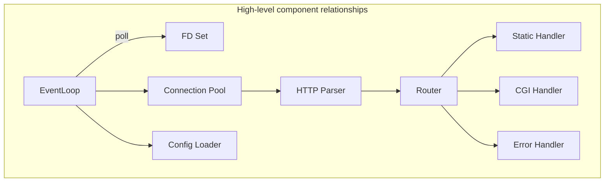

# ADR-001: Modelo de Concorrência e Multiplexação I/O
# Status: Proposed

## Context
O enunciado exige um servidor **não-bloqueante** com **um único loop de multiplexação** (poll/select/epoll/kqueue) para todo o I/O de sockets e pipes. É proibido executar operações de leitura/escrita sem readiness e também é proibido ajustar o comportamento após read/write consultando errno. O projeto deve ser C++98 e sem bibliotecas externas.

## Decision
Implementar arquitetura **single-threaded event loop** com **um único multiplexador**. Usar **poll()** como implementação padrão (portável) encapsulada em `EventLoop`, permitindo trocar por epoll/kqueue no futuro sem alterar a lógica. O loop monitora simultaneamente leitura e escrita (POLLIN|POLLOUT) de sockets e pipes CGI.

## Consequences
- Conformidade total com o enunciado e simplicidade arquitetural.
- Necessidade de estado explícito por conexão e buffers não-bloqueantes.
- Sem paralelismo por threads; escalabilidade depende da eficiência do loop e design de buffers.

## Alternatives Considered
- **epoll** direto (Linux): mais eficiente, porém menos portátil.
- **select**: mais simples, porém limitado por FD_SETSIZE.
- **multi-thread**: viola o requisito de um único loop.

## Implementação (chamadas de sistema)
- `poll`, `fcntl` (O_NONBLOCK), `read`, `write`, `recv`, `send`, `close`.

## Estruturas sugeridas
```cpp
struct EventLoop {
    std::vector<pollfd> fds;
    std::map<int, Connection*> conns;
    std::vector<PollAction> pending;
};

struct Connection {
    int fd;
    ConnState state;
    std::string rbuf;
    std::string wbuf;
    HttpParser parser;
    time_t last_activity;
    bool wants_write;
};
```

## Detecção de erro sem errno
- `pollfd.revents` com POLLERR|POLLHUP|POLLNVAL.
- `read()==0` indica fechamento remoto.
- `write()<0` tratado como “sem progresso”; manter POLLOUT até timeout.

## Referências
- RFC 9112 (HTTP/1.1), Seções 2, 6, 9.

## Testes
- Múltiplos clientes concorrentes (ab, wrk).
- Desconexões abruptas.
- Validação de timeouts e ausência de bloqueio.

## Mermaid – Visão geral do sistema


## Referências Cruzadas
- ADR-002 (Sockets e ciclo de vida)
- ADR-008 (CGI no mesmo loop)
