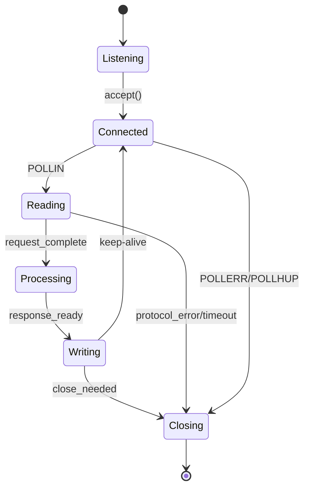

# ADR-002: Sockets e Ciclo de Vida de Conexões
# Status: Proposed

## Context
O servidor deve ser não-bloqueante, aceitar múltiplas portas e nunca ler/escrever sem readiness. Conexões devem ser encerradas corretamente e o servidor deve permanecer disponível sob carga.

## Decision
- Configurar sockets de escuta com `socket`, `setsockopt(SO_REUSEADDR)`, `bind`, `listen`, `fcntl(O_NONBLOCK)`.
- Executar `accept()` apenas quando `poll` indicar `POLLIN` no socket de escuta.
- Cada conexão mantém estado e buffers; fechar de forma graciosa após resposta ou erro de protocolo.

## Consequences
- Exige estrutura de estados por conexão.
- Controle explícito de fechamento e timeouts.

## Alternatives Considered
- Operações bloqueantes: proibidas pelo enunciado.
- Multiplicidade de loops: proibido.

## Implementação (chamadas de sistema)
- `socket`, `setsockopt`, `bind`, `listen`, `accept`, `fcntl`, `getsockname`, `close`.

## Estruturas sugeridas
```cpp
struct Listener {
    int fd;
    std::string host;
    int port;
};
```

## Detecção de erro sem errno
- `pollfd.revents` com POLLERR|POLLHUP|POLLNVAL.
- `read()==0` indica fechamento remoto.

## Testes
- Múltiplas portas ativas.
- Conexões simultâneas e desconexões abruptas.

## Mermaid – Máquina de estados de conexão


## Referências Cruzadas
- ADR-001 (Modelo de concorrência)
- ADR-011 (Virtual hosts e multi-porta)
