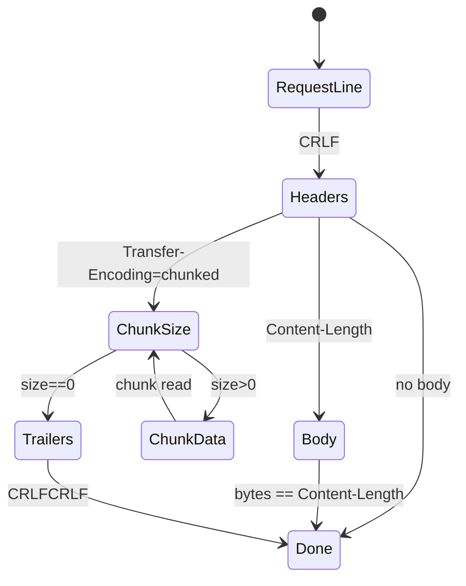

# ADR-003: Parsing HTTP/1.1 e Framing
# Status: Proposed

## Context
Requisições HTTP chegam em partes; o servidor precisa de parser incremental, com suporte a `Content-Length` e `Transfer-Encoding: chunked`, conforme RFC 9112. É proibido depender de errno após read/write.

## Decision
- Parser incremental por conexão com estados: `REQUEST_LINE`, `HEADERS`, `BODY`, `CHUNK_SIZE`, `CHUNK_DATA`, `TRAILERS`, `DONE`.
- Regras de framing conforme RFC 9112 §2–7 e RFC 9110 §6.
- Limitar tamanho do body conforme config; responder 413 ao exceder.

## Consequences
- Lógica mais complexa, porém compatível com browsers modernos.
- Exige buffer e controle rígido de limites.

## Alternatives Considered
- Parse completo apenas ao fechar socket: incompatível com keep-alive.
- Ignorar chunked: quebra compatibilidade HTTP/1.1.

## Implementação (chamadas de sistema)
- `recv`, `read` (somente após readiness).

## Estruturas sugeridas
```cpp
struct HttpRequest {
    std::string method;
    std::string target;
    std::string version;
    std::map<std::string, std::string> headers;
    std::string body;
    size_t content_length;
    bool chunked;
};

struct HttpParser {
    ParseState state;
    std::string buffer;
    size_t expected;
};
```

## Detecção de erro sem errno
- Erros de protocolo detectados por inconsistência sintática (linha inválida, headers malformados, chunk size inválido).
- `read()==0` indica fim de stream.

## Referências
- RFC 9112: Seções 2–7 (formato, parsing, chunked).
- RFC 9110: Seção 6 (framing e completude).

## Testes
- Parsing parcial de request line/headers.
- Chunked válido e inválido.
- Headers grandes e limite de body.

## Mermaid – Máquina de estados do parser


## Referências Cruzadas
- ADR-007 (Tratamento de erros)
