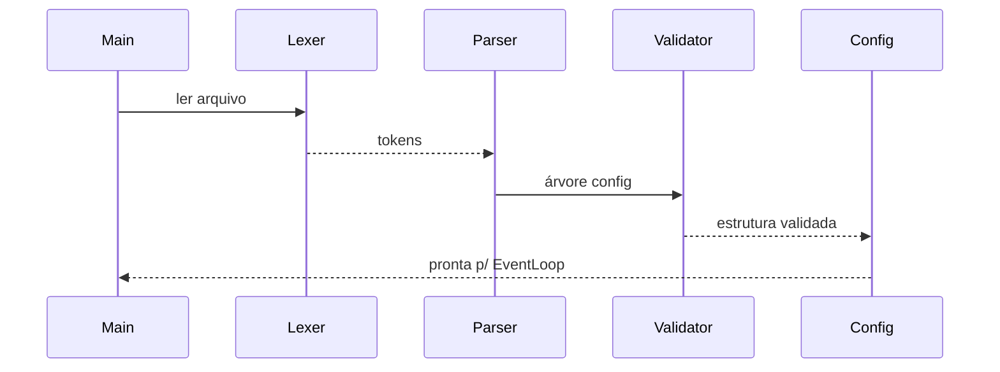

# ADR-004: Parsing e Validação de Configuração
# Status: Proposed

## Context
O projeto exige arquivo de configuração inspirado no NGINX, com diretivas de server e rotas. Não é permitido usar bibliotecas externas. É necessário validar o arquivo antes de iniciar o servidor.

## Decision
- Parser baseado em tokens (`{`, `}`, `;`) e diretivas lineares.
- Estruturas `ServerConfig` e `LocationConfig` com herança simples (server → location).
- Validação completa no carregamento; falha impede startup.
- **Sem hot-reload**: reconfiguração apenas via reinício do processo.

## Consequences
- Fail-fast em caso de config inválida.
- Simplicidade e previsibilidade; sem reconfiguração dinâmica.

## Alternatives Considered
- Hot-reload: complexidade extra e risco com conexões ativas.
- JSON/YAML: exigiria bibliotecas externas (proibido).

## Implementação (chamadas de sistema)
- `open`, `read`, `close`, `stat`.

## Estruturas sugeridas
```cpp
struct Listen {
    std::string host;
    int port;
};

struct LocationConfig {
    std::string path;
    std::set<std::string> methods;
    bool autoindex;
    std::string root;
    std::string index;
    bool upload_enabled;
    std::string upload_dir;
    bool has_redirect;
    int redirect_code;
    std::string redirect_target;
    std::map<std::string, std::string> cgi_map;
    size_t client_max_body_size;
};

struct ServerConfig {
    std::vector<Listen> listens;
    std::string server_name;
    std::string root;
    std::map<int, std::string> error_pages;
    size_t client_max_body_size;
    std::vector<LocationConfig> locations;
};
```

## Detecção de erro sem errno
- Validação semântica baseada em tokens e diretivas faltantes/duplicadas.

## Testes
- Config válida e inválida.
- Diretivas repetidas e ausentes.
- Herança correta de `client_max_body_size`.

## Mermaid – Carregamento de configuração


## Referências Cruzadas
- ADR-005 (Roteamento)
- ADR-006 (Serviço de arquivos)
- ADR-008 (CGI)
