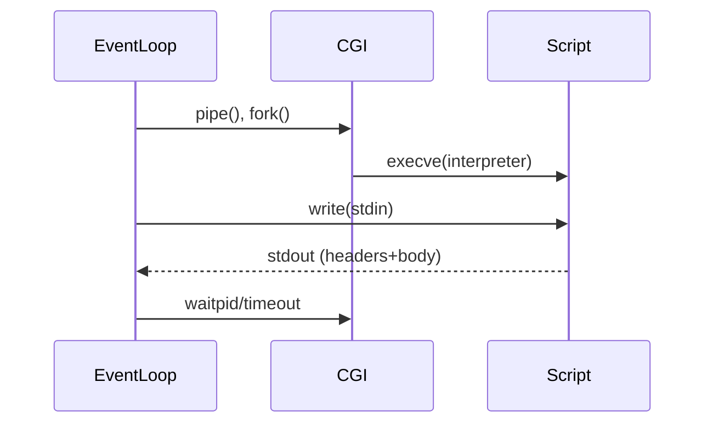
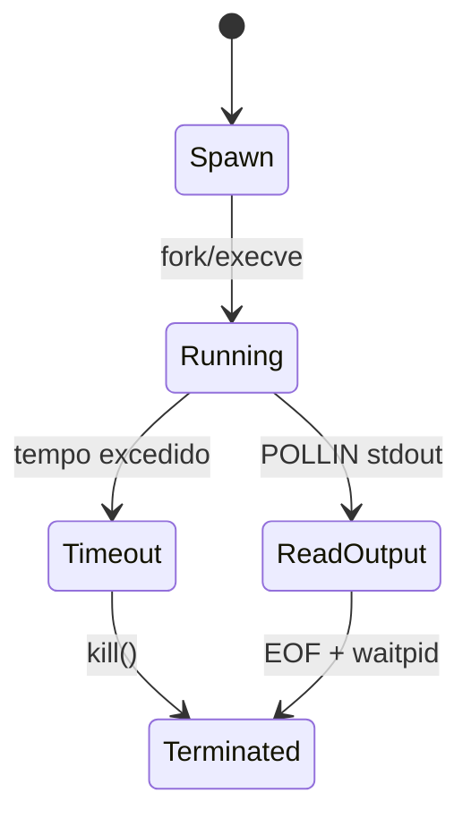

# ADR-008: Execução de CGI
# Status: Proposed

## Context
CGI é obrigatório. O enunciado restringe o uso de `fork` apenas para CGI. As variáveis de ambiente seguem RFC 3875 e o servidor deve suportar pelo menos um CGI (php-cgi, python etc.).

## Decision
- Para requests mapeadas a CGI: criar pipes stdin/stdout, `fork`, `dup2`, `execve` do interpretador.
- Construir ambiente com meta-variáveis RFC 3875 §4.1 e cabeçalhos HTTP como `HTTP_*`.
- Passar body ao stdin do CGI; ler stdout até EOF se não houver Content-Length.
- Timeout rígido; excedeu, `kill` e responder 504/500.

## Consequences
- Integração de pipes ao poll.
- Necessidade de montar ambiente completo e seguro.

## Alternatives Considered
- Executar CGI bloqueante: proibido.
- Threads: desnecessário e fora do escopo.

## Implementação (chamadas de sistema)
- `pipe`, `fork`, `dup2`, `execve`, `close`, `waitpid`, `kill`, `chdir`.

## Estruturas sugeridas
```cpp
struct CgiProcess {
    pid_t pid;
    int stdin_fd;
    int stdout_fd;
    time_t start_time;
    int timeout_ms;
    std::vector<std::string> env;
};
```

## Variáveis de ambiente (RFC 3875)
- Obrigatórias: `GATEWAY_INTERFACE`, `REQUEST_METHOD`, `SCRIPT_NAME`, `SERVER_NAME`, `SERVER_PORT`, `SERVER_PROTOCOL`, `SERVER_SOFTWARE`, `QUERY_STRING`, `REMOTE_ADDR`.
- Condicionais: `CONTENT_LENGTH`, `CONTENT_TYPE`, `AUTH_TYPE`, `REMOTE_USER`, `PATH_INFO`, `PATH_TRANSLATED`.
- Cabeçalhos: `HTTP_<NOME>` (ex.: `HTTP_USER_AGENT`).

## Referências
- RFC 3875, Seções 4 e 6.

## Testes
- CGI simples (echo).
- CGI com body chunked.
- Timeout de script.

## Mermaid – Fluxo de execução CGI


## Mermaid – Máquina de estados CGI


## Referências Cruzadas
- ADR-001 (Event loop)
- ADR-003 (Parsing)
